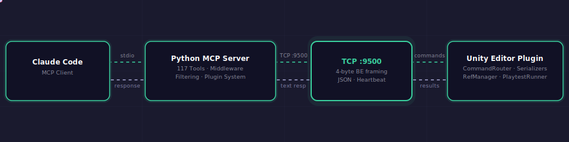
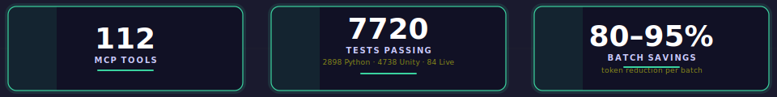

# Unity MCP — Control Unity Editor from Any AI Assistant

<div align="center">



<a href="https://github.com/german-krasnikov/unity-kiss-mcp">

</a>

</div>

<!-- ───────────────────────────  BADGE WALL  ─────────────────────────── -->

<div align="center">

<sub>**STATUS**</sub><br>


<sub>**SPEC**</sub><br>


<sub>**STACK**</sub><br>


</div>

> **Let any MCP-compatible AI assistant control your Unity Editor** — inspect scenes, edit GameObjects, run playtests, and capture screenshots without leaving the chat. Binary TCP protocol with 10–15× token compression and 80–95% batch savings.

<sub>MCP (Model Context Protocol) is Anthropic's open standard for giving AI assistants structured tool access.</sub>


## Why Unity MCP?

- **Stop alt-tabbing.** Your AI assistant inspects your scene, edits components, runs playtests, and captures screenshots without you leaving the chat.
- **Stop burning tokens on boilerplate.** Each `batch` call replaces 5–20 individual round-trips — **80–95% fewer tokens** on the same work.
- **Stop writing glue code.** Registered tools cover scene CRUD, animation, VFX, UI, shaders, runtime control, and code intelligence — with a plugin seam for your own.

### Two ways to work

🖥️ **CLI Mode** — run from terminal via Claude Code, Codex CLI, or any MCP client. The Python server connects to Unity over TCP :9500. Best for automation, batch operations, and scripting. Full access to 94 MCP tools with 80–95% token compression.

💬 **In-Unity Chat** — open `Window → MCP Chat` inside the editor. No API key needed — spawns the Claude or Codex CLI directly. Drag GameObjects, scripts, and materials into chat as typed context chips. Each AI turn gets its own undo group — one Ctrl+Z rolls back everything the AI changed. Domain-reload safe. Extensible chip-kind registry lets third-party plugins add new chip types with zero core edits.

**Before / after — creating and configuring 3 objects:**

```python
# Before: 9 separate MCP calls (~1800 tokens)
create_object("Enemy")
set_property("Enemy", "Transform", "position", "0,1,0")
manage_component("Enemy", "add", "Health")
set_property("Enemy", "Health", "maxHp", "100")
# ... 5 more calls
```

```python
# After: 1 batch call (~120 tokens, 93% savings)
batch([
  {"cmd": "create_object",    "path": "Enemy", "type": "Empty"},
  {"cmd": "set_property",     "path": "Enemy", "component": "Transform", "property": "position", "value": "0,1,0"},
  {"cmd": "manage_component", "path": "Enemy", "action": "add", "component": "Health"},
  {"cmd": "set_property",     "path": "Enemy", "component": "Health", "property": "maxHp", "value": "100"},
])
```


### Architecture



## Quick Start

**Prerequisites:** <kbd>Python 3.10+</kbd> · <kbd>Unity 6000.0+</kbd> · <kbd>Claude Code</kbd> or <kbd>Codex CLI</kbd> · TCP port <kbd>9500</kbd> free

**1. Install the Python server**

```bash
git clone https://github.com/german-krasnikov/unity-kiss-mcp.git
cd unity-kiss-mcp/server && pip install -e ".[dev]"
```

**2. Install the Unity plugin**

Add to your project's `Packages/manifest.json`:

```json
{
  "dependencies": {
    "com.unity-mcp.editor": "file:/absolute/path/to/unity-kiss-mcp/unity-plugin"
  }
}
```

Open Unity — wait for `[MCP] Server started on port 9500` in the Console.

**3. Configure your MCP client**

<details open>
<summary><b>Claude Code</b></summary>

Add to `~/.claude/mcp_settings.json`:

```json
{
  "mcpServers": {
    "unity-mcp": {
      "command": "python",
      "args": ["-m", "unity_mcp.server"],
      "cwd": "/absolute/path/to/unity-kiss-mcp/server"
    }
  }
}
```

Restart Claude Code. Call `get_hierarchy()` to verify.

</details>

<details>
<summary><b>Codex CLI</b></summary>

Add to `.codex/config.toml` in your project root:

```toml
[mcp_servers.unity-mcp]
command = "python"
args = ["-m", "unity_mcp.server"]
cwd = "/absolute/path/to/unity-kiss-mcp/server"
```

</details>

<details>
<summary><b>Other MCP clients</b></summary>

Use the standard `mcpServers` JSON block — same structure as Claude Code but in your client's config file. The server uses stdio transport.

</details>

<details>
<summary><b>Troubleshooting</b></summary>

- **Port 9500 not listening** — Ensure plugin is in `manifest.json`. Click Unity window to recompile. Check Console.
- **"Connection refused"** — Unity must be open with the plugin. Server auto-retries on reconnect.
- **Tools don't appear** — Verify path in `mcp_settings.json`. Restart Claude Code. `pip show unity-mcp`.
- **C# changes not reflected** — Click Unity window or `open -a Unity` (macOS) to trigger recompile.
- **Security** — TCP server binds to `localhost` only. Do not expose port 9500 to the network.

</details>

<details>
<summary><b>Compatibility</b></summary>

| Component | Tested | Minimum |
|-----------|--------|---------|
| Unity | 6000.3 | 6000.0 (Unity 6) |
| Python | 3.12 | 3.10 |
| OS | macOS | macOS, Windows, Linux |
| Claude Code | latest | any with MCP support |
| Codex CLI | latest | any with MCP support |
| Claude Desktop | latest | any with MCP support |

</details>




## Features

- **Token Optimization** — `batch` compresses 5–20 calls into one (80–95% savings), deferred tool schemas, per-session cost analytics
- **In-Unity Chat** — Claude/Codex backends, no API key needed, typed context chips (`[hierarchy:/Player]`, `[script:Health.cs]`), per-turn undo, domain-reload safe
- **Code Intelligence** — Roslyn-powered `find_references`, `compile_preflight`, `semantic_at`
- **PlayTest DSL** — 21 commands: `MOVE`, `ASSERT`, `WAIT_UNTIL`, `INVOKE`, `SNAPSHOT`, `SIMULATE`
- **Multi-Scene Management** — Load multiple scenes, inspect/edit across scenes, move/copy objects between loaded scenes, unified `object_diff` for cross-scene comparison
- **Scene CRUD & Tools** — `scene` actions (open_additive, close, set_active, list), hierarchy inspection, query syntax, diff tracking, checkpoint/restore
- **Animation & Timeline** — clips, key management, Timeline assets, Animator states/transitions
- **VFX & Particles** — particle system CRUD, 11 module presets, shader graph integration
- **Multi-View Screenshots** — 4-panel grid (Front/Left/Top/Iso), bounding-box overlay, visual regression
- **Multi-Project Ports** — each Unity project auto-assigns a unique TCP port (9500–9599), CLI and Chat get isolated slots
- **Capability Gating** — TIER1 core always on; 8 category toggles per-session
- **Cross-Platform** — Windows, macOS, Linux — binary resolution, lockfile, and venv per platform
- **Plugin Extensibility** — register your own tools in one file, no cross-imports

<details>
<summary><b>PlayTest DSL example</b></summary>

```
run_playtest(script="""
MOVE /Player TO 5,0,3
WAIT_UNTIL /Enemy|Health|hp <= 0 timeout=5
ASSERT /Player|Health|hp > 0
ASSERT_CONSOLE_CLEAN
SNAPSHOT /Player /Enemy
""")
```

</details>

<details>
<summary><b>Add your own tool</b> — one file, zero cross-imports</summary>

```python
# server/src/unity_mcp/tools/my_tool.py
def register(mcp, send, args):
    @mcp.tool()
    async def find_inactive(path: str = "/") -> str:
        """Find all inactive GameObjects under path."""
        return await send("find_objects", args(path=path, active="false"))
```

Drop the file in `tools/` — it's auto-discovered on next server start.

</details>


## Recent Changes

<div><sub>Full history: <a href="CHANGELOG.md"><b>CHANGELOG.md</b></a></sub></div>

<!-- CHANGELOG_START -->
<details>
<summary><b>v0.25.0</b> — 2026-06-12 — Multi-scene CRUD + test filter + compile check workflow</summary>

**Multi-Scene CRUD + Diff (Plugin v0.25.0)** — Cross-scene `transfer_object` (move/copy between scenes), `object_diff` (unified diff of two objects sh …

</details>

<details>
<summary><b>v0.24.1</b> — 2026-06-12 — Port re-discovery on reconnect + lockfile takeover + 9 new tests</summary>

**Port Re-Discovery on Reconnect (Server v0.24.1)** — UnityBridge now auto-rediscovers Unity's port when reconnecting after a restart.

</details>

<details>
<summary><b>v0.24.0</b> — 2026-06-12 — Multi-scene hierarchy support + temp test assets refactor</summary>

**Multi-Scene Hierarchy Support (Plugin v0.24.0)** — `get_hierarchy` now handles multiple loaded scenes with scene-aware context headers.

</details>

<details>
<summary><b>v0.23.13</b> — 2026-06-11 — Unified settings + media viewers + LLM config + review hardening</summary>

**SettingsNavController Hardening (Plugin v0.23.13)** — Timer-based animated transitions between settings pages (iOS-style slide), input-field tab/Esc …

</details>

<details>
<summary><b>v0.23.0</b> — 2026-06-11 — Reconnect recovery + installer + unified settings + media viewers + DRY sampling</summary>

**Reconnect Recovery: Zombie Detection + SO_REUSEPORT + TCP Probe (Server + Plugin v0.23.0)** — Fixes `-32000 server error` during rapid reconnection  …

</details>

<details>
<summary>Older releases</summary>

- **v0.22.1** — 2026-06-11 — Crash logging for unhandled MCP server exceptions
- **v0.22.0** — 2026-06-11 — Multi-project port auto-assignment + dual-port isolation + PortResolver extraction
- **v0.21.0** — 2026-06-11 — Cross-platform Windows/Linux support + zero manual patching
- **v0.20.7** — 2026-06-10 — Reload-resume re-sends the full-path chip payload, not short-name mentions (task#10)
- **v0.20.6** — 2026-06-10 — Full-path chip payload + always-raw "Show LLM payload" inspector for every turn type
- **v0.20.0** — 2026-06-10 — Chip-unification Phase 1 — delete SceneNameLinker path, unified @-mention rendering
- **v0.19.2** — 2026-06-10 — Chat reload double-bubble MAJOR + drag-drop crash guard + clean test console
- **v0.19.1** — 2026-06-10 — P0/P1 chat UX hardening — ResetTurnFlags DRY, bubble dedup, backend restore race
- **v0.19.0** — 2026-06-10 — Chat UX F27–F30 — Domain reload + external drag/drop + input height + backend cleanup
- **v0.18.0** — 2026-06-10 — Chat UX F20–F26 — Stop button, reload survival, AutoScroll, dropdown persist, @Object dedup, direct Clear, drag/drop MonoScript
- **v0.17.36** — 2026-06-06 — Settings Hub redesign — central hub UI + circuit-node header animation + Claude foldout grouping
- **v0.17.34** — 2026-06-06 — F25 Phase 2 settings hub — unique thematic header animations per sub-window
- **v0.17.28** — 2026-06-06 — F23 settings split — 3 focused EditorWindows + Chat event hook
- **v0.17.20** — 2026-06-06 — 40-architect test audit — 299 new tests total, 3 P0+P1 bug fixes
- **v0.17.18** — 2026-06-06 — F20–F22 bugfixes — select-all, @mention search, orphan bold
- **v0.17.17** — 2026-06-05 — F15a-F19 chip redesign — linker disable, leading-space guard, context menus
- **v0.17.14** — 2026-06-05 — F13–F14 inline-chip architecture + bare-name normalizer + review fixes
- **v0.17.2** — 2026-06-05 — inline context chips + review fixes (regex + staleness + test DRY)
- **v0.17.0** — 2026-06-05 — full-project code review sprint — 12 waves of fixes across Python + C#
- **v0.16.0** — 2026-06-05 — F12 chat UX overhaul — composed inline-chip field + response pills + session clear
- **v0.15.8** — 2026-06-05 — inline-chips + extensible chip-kind registry — F11
- **v0.15.0** — 2026-06-04 — chat UX polish sprint — F1–F10 + review-hardening
- **v0.14.0** — 2026-06-04 — multi-backend agent chat — Claude + Codex via DRY CliBackendBase
- **v0.7.1** — 2026-06-04 — tech-debt sprint wave 1–3 (Python/C#/Chat) — pure quality
- **v0.7.0** — 2026-06-04 — Editor.log out-of-band corroboration — P0 compile-tool blindness fix
- **v0.6.1** — 2026-06-04 — atomic batch rollback — transactional scene edits
- **v0.5.0 / 0.12.0** — 2026-06-04 — scoped scene queries — search_scene root+limit + spatial center
- **v0.11.0** — 2026-06-04 — per-turn undo rollback + Restore button
- **v0.10.0** — 2026-06-04 — chat plan/act approve & execute + slash templates
- **v0.9.0** — 2026-06-04 — chat context resolution + compile gating tool
- **v0.8.0** — 2026-06-04 — compile auto-fix + editor-state injection + tool ping
- **v0.7.0** — 2026-06-04 — F4 deferred schema + reload-survival + auto-selection
- **v0.6.0** — 2026-06-03 — Aura pill + native theme + perms gating
- **v0.5.0** — 2026-06-03 — chat UX polish — refs, grouping, scroll
- **v0.4.0** — 2026-06-03 — extensible render: md + mermaid + img
- **v0.3.0** — 2026-06-03 — in-Unity Agent Chat + UIToolkit status
- **v0.2.6** — 2026-06-02 — tool-gating fix + settings UI

</details>
<!-- CHANGELOG_END -->


## Contributing

```bash
# Python tests (no Unity needed)
cd server && pytest -m "not live" -v

# With Unity running on :9500
pytest -m "live"

# C# tests — Unity Test Runner → EditMode
```

Architecture overview: [`AI/architecture.md`](AI/architecture.md) · Full tool catalog: [`AI/mcp-server.md`](AI/mcp-server.md)


<div align="center"><sub>MIT License · © <a href="https://github.com/german-krasnikov">German Krasnikov</a> · <a href="https://github.com/german-krasnikov/unity-kiss-mcp">⭐ Star</a></sub></div>
