<div align="center">


<a href="https://github.com/german-krasnikov/unity-kiss-mcp">

</a>

</div>

<!-- ───────────────────────────  BADGE WALL  ─────────────────────────── -->

<div align="center">

<sub>**STATUS**</sub><br>


<sub>**SPEC**</sub><br>


<sub>**STACK**</sub><br>


</div>

> **MCP server bridging Claude Code to the Unity Editor over a binary protocol** — 10–15× token compression, capability gating, and a live status window whose heartbeat the banner above mirrors beat-for-beat.

<br>

<!-- ───────────────────────────  STAT RIBBON  ─────────────────────────── -->

<div align="center">

<table>
<tr>
<td align="center" width="33%"><h2><code>89</code></h2><sub>REGISTERED MCP TOOLS</sub><br><sub>core + plugin extensibility</sub></td>
<td align="center" width="33%"><h2><code>1640</code></h2><sub>TESTS COLLECTED</sub><br><sub>1588 unit · 52 live</sub></td>
<td align="center" width="33%"><h2><code>80–95%</code></h2><sub>BATCH TOKEN SAVINGS</sub><br><sub>vs. individual calls</sub></td>
</tr>
</table>

</div>


## By the Numbers

A grounded factual block — no invented benchmarks, every figure read from the source tree.

| Metric | Value |
|--------|-------|
| **Registered MCP Tools** | 89 core + plugin extensibility |
| **Python Tests** | 1588 unit tests + 52 live integration tests (1640 collected) |
| **C# Test Suite** | 754 / 756 NUnit tests passing (EditMode + PlayMode) |
| **Batch Token Savings** | 80–95% compression vs. individual calls |
| **Python Modules** | 85 source files + 23-layer middleware pipeline |
| **C# Code Files** | 76+ files including 7 specialized serializers |
| **MCP Tool Categories** | 8 discoverable + TIER1 core (38 always visible) |
| **PlayTest DSL Commands** | 21 commands (`MOVE`, `ASSERT`, `INVOKE`, `SNAPSHOT`, …) |
| **TCP Framing Overhead** | 4-byte big-endian length prefix |
| **Message Size Limit** | 10 MB max · per-command 30–120 s timeouts |


## Features

The same surface, grouped by subsystem. Everything below ships today.

### 💸 Tokens

| | Capability |
|---|---|
| 📊 **Batch Operations** | Multi-command DSL execution in a single call — **80–95% token savings** vs. individual calls; includes `setup_objects`, `set_properties`, `configure_objects` |
| ⚡ **Batch Text Protocol** | Binary framing (4-byte BE length + JSON) over `TCP:9500` minimizes overhead; no JSON bloat in the request/response cycle |
| 📈 **Token Analytics** | Built-in metrics tracking command costs, response sizes, batch compression ratios, and Haiku spend (on-device budgeting with lock-protected daily caps) |

### 🎬 Runtime

| | Capability |
|---|---|
| 🎬 **PlayTest DSL** | 21-command runtime testing language (`MOVE`, `WAIT_UNTIL`, `ASSERT`, `ASSERT_CONSOLE_CLEAN`, `SNAPSHOT`, `INVOKE`, `SET`, `SIMULATE`, …) with adaptive assertions and flow tracing |
| 🎭 **Play Mode Control** | Runtime property mutation, method invocation, state queries, wait conditions, teleportation, and time-scale control without leaving the editor |

### 🏗️ Scene

| | Capability |
|---|---|
| 🏗️ **Scene Management** | Full scene CRUD with hierarchy inspection, search via Unity query syntax, diff tracking, checkpoint/restore, and auto-discard on quit |
| 🧩 **Animation & Timeline** | Create/edit animation clips with key management, timeline assets with track/clip binding, animator controllers with state/transition/parameter management |
| ✨ **VFX & Particles** | Particle system CRUD with 11 module presets (Emission, Shape, Force, Collision, …) and complete shader graph integration |

### 🎨 Visuals

| | Capability |
|---|---|
| 🎨 **Multi-View Screenshots** | 4-panel grid captures (Front / Left / Top / Isometric) with collision visualization, bounding-box overlay, set-of-mark annotations, and visual regression testing |

### 🛠️ DX

| | Capability |
|---|---|
| 🎯 **89 MCP Tools** | Registered core tools for scene CRUD, animation, UI, shaders, particles, runtime control, code intelligence, assets, and spatial queries — with dynamic plugin extension |
| 🔍 **Code Intelligence** | Roslyn-powered `find_references`, `compile_preflight` validation, and `semantic_at` symbol lookup for C# without disk writes |
| 🎁 **Capability Gating** | TIER1 core tools always visible; 8 category toggles (`SCENE_EDIT`, `ANIMATION`, `VFX`, `UI`, `ASSETS`, …) controllable per-session; Python-authoritative catalog synced to the Unity settings UI |
| 🔗 **Multi-Unity Connections** | Switch between multiple running Unity editors; transfer references between projects; persistent session save/load with scene state recovery |
| 🎯 **NL Intent Tools** | High-level `do`/`ask` meta-tools + domain-specific `animator_intent`/`vfx_intent`/`ui_intent` that convert natural language to batch commands with Haiku validation |


## First Steps

One continuous editor surface, from clone to first `get_hierarchy()`. Each step is independently verifiable — expand as you go.

**Requirements**

- <kbd>Python 3.10+</kbd>
- <kbd>Unity 2021.3+</kbd> (2022.3+ recommended per the plugin `package.json`)
- <kbd>Claude Code</kbd> or any MCP client supporting **stdio** transport
- TCP port <kbd>9500</kbd> available for Unity Editor plugin communication

<details>
<summary><b>1 · Install the Python MCP Server</b></summary>

<br>

Clone the repository and install the server with development dependencies:

```bash
cd /path/to/unity-kiss-mcp/server
pip install -e ".[dev]"
```

This installs:

- `mcp >= 1.0.0`
- `pydantic >= 2.0`
- `Pillow >= 10.0`
- `pytest >= 8.0`, `pytest-asyncio >= 0.23` (dev only)

The server binary `unity-mcp` will be available in your Python environment.

</details>

<details>
<summary><b>2 · Install the Unity Plugin</b></summary>

<br>

Add the plugin to your Unity project (2022.3+ recommended, 2021.3+ supported).

**Option A — Using `manifest.json` (recommended)**

Add to `Packages/manifest.json` in your Unity project:

```json
{
  "dependencies": {
    "com.unity-mcp.editor": "file:../unity-kiss-mcp/unity-plugin"
  }
}
```

**Option B — Using Package Manager UI**

In the Unity Editor:

1. **Window → Package Manager**
2. Click the **+** icon
3. Select **"Add package from disk…"**
4. Navigate to `unity-plugin/package.json`

Once installed, open the Unity Console and wait for the line:

```
[MCP] Server started on port 9500
```

</details>

<details>
<summary><b>3 · Configure the Claude Code MCP Client</b></summary>

<br>

Create or update `~/.claude/mcp_settings.json`:

```json
{
  "mcpServers": {
    "unity-mcp": {
      "command": "python",
      "args": ["-m", "unity_mcp.server"],
      "cwd": "/path/to/unity-kiss-mcp/server"
    }
  }
}
```

Replace `/path/to/unity-kiss-mcp/server` with the absolute path to the server directory.

Alternatively, configure according to your MCP client's documentation — the server supports any stdio-based MCP client.

Restart Claude Code. The `unity-mcp` server will appear in your available tools.

</details>

<details>
<summary><b>4 · Verify Port 9500 Connectivity</b></summary>

<br>

Confirm the Unity Editor plugin is listening on `TCP:9500`:

```bash
lsof -i :9500
```

You should see output like:

```
UNITY     12345  user  42u  IPv4  0x1234abcd  0t0  TCP  localhost:9500 (LISTEN)
```

If the port is not open:

1. Open the Unity Editor
2. Wait 5–10 seconds for the plugin to initialize
3. Check the Console tab for `[MCP] Server started on port 9500`
4. Re-run the `lsof` command above

</details>

<details>
<summary><b>5 · Run Server Tests (no Unity required)</b></summary>

<br>

Test the Python MCP server without Unity running:

```bash
cd /path/to/unity-kiss-mcp/server
pytest tests/ -v
```

This collects **1640** tests (1588 passing units; ~52 live tests require Unity). Expected:

```
...
1640 tests collected in 0.80s
======== 1588 passed in X.XXs ========
```

To run only tests that don't require Unity:

```bash
pytest -m "not live" -v
```

</details>

<details>
<summary><b>6 · Verify End-to-End Integration</b></summary>

<br>

With both the Python server running and the Unity Editor open with the plugin installed:

```bash
# In a separate terminal, start the server manually to verify it works
cd /path/to/unity-kiss-mcp/server
python -m unity_mcp.server
```

Expected output:

```
Starting MCP server on stdio...
[MCP] Connecting to Unity on TCP :9500...
```

Or run the live integration tests (requires Unity running):

```bash
pytest -m "live" -v
```

In Claude Code, call a simple tool like `get_hierarchy()` to confirm the connection works.

</details>

**Verify checklist**

- [ ] Run `lsof -i :9500` and confirm Unity is listening
- [ ] Run `pytest tests/ -v` and confirm **1588+** tests pass
- [ ] Restart Claude Code and confirm `unity-mcp` appears in the tools panel
- [ ] In Claude Code, call `get_hierarchy()` and verify it returns your scene structure
- [ ] Check the Unity Console for `[MCP] Server started on port 9500`

<details>
<summary><b>🩺 Troubleshooting</b></summary>

<br>

| Symptom | Fix |
|---|---|
| **Port 9500 not listening after opening Unity** | Ensure the plugin is installed in `Packages/manifest.json` or via Package Manager. Click the Unity window to force recompilation, then check the Console. If still not listening, run **Assets → Reimport All**. |
| **"Connection refused" when calling tools** | Verify the Unity Editor is running with the plugin installed. Start the server in a terminal (`python -m unity_mcp.server`) to see connection logs. The server auto-retries on reconnect. |
| **`unity-mcp not available` / tools don't appear** | Verify `~/.claude/mcp_settings.json` has the correct path. Restart Claude Code completely. Confirm the package is installed: `pip show unity-mcp`. |
| **C# plugin changes not reflected** | After editing C#, click the Unity window to recompile, or run `osascript -e 'tell application "Unity" to activate'` (macOS). Then check the Console for errors. |
| **`ModuleNotFoundError: No module named unity_mcp`** | Reinstall in editable mode: `cd /path/to/unity-kiss-mcp/server && pip install -e '.[dev]'`. Run tests from that directory. |

</details>


## Architecture

Data inhaled, pulse exhaled — Claude's intent compresses into a batch, crosses the 4-byte-framed TCP wire, and returns as a single response.

```mermaid
%%{init: {'theme':'base','themeVariables':{
  'background':'#1a1a2e',
  'primaryColor':'#1a1a2e',
  'primaryTextColor':'#ccccff',
  'primaryBorderColor':'#3ad29f',
  'lineColor':'#e94560',
  'secondaryColor':'#23234a',
  'tertiaryColor':'#15152a',
  'fontFamily':'Fira Code, monospace'
}}}%%
flowchart LR
    subgraph CLIENT["Claude Code"]
        A["MCP Client<br/>(stdio)"]
    end

    subgraph PY["Python MCP Server · v0.2.0"]
        B["Dynamic Tool Filtering<br/>Capability Gating"]
        C["Plugin System<br/>89 tools + extensions"]
        D["23-layer Middleware<br/>Token Analytics · Heartbeat"]
    end

    subgraph WIRE["Binary Protocol"]
        E["TCP :9500<br/>4-byte BE length + JSON"]
    end

    subgraph UNITY["Unity Editor Plugin · v0.5.0"]
        F["CommandRouter (async)<br/>CommandRegistry + ValueParser"]
        G["Serializers ×7 · RuntimeHelper<br/>PlaytestRunner · RefManager"]
        H["ScreenshotCapture<br/>MultiView · CodeExecutor"]
    end

    A -- "stdio" --> B
    B --> C --> D
    D -- "send / args" --> E
    E -- "10MB max · 30-120s" --> F
    F --> G --> H
    H -- "text response" --> E
    E -- "compressed result" --> A
```




## Changelog



<div align="center"><sub>📜 auto-generated from <a href="CHANGELOG.md"><b>CHANGELOG.md</b></a> — the single source of truth · full history, newest first</sub></div>


## Meet the Crew

This project is built by an agent team — an instrument panel of subsystems, rendered here as quiet end-credits grouped by function. The human stays at the console.

### Strategy

| | Role | Tier | Brief |
|---|---|---|---|
| 🏛 | **Senior Architect** | `opus` | Designs the 35-phase evolution from a TCP skeleton to an 89-tool platform with 80–95% batch token savings. |

### Build

| | Role | Tier | Brief |
|---|---|---|---|
| 🔧 | **Senior Developer** | `sonnet` | Ships modular tools, the plugin registry, command routing, and middleware hardening across the Python modules. |

### Quality

| | Role | Tier | Brief |
|---|---|---|---|
| 🔍 | **Code Reviewer** | `sonnet` | Catches adversarial bugs, dedup edge cases, and protocol invariants; hardens `CircuitBreaker` logic. |
| 🎮 | **PlayMode Tester** | `haiku` | Drives 52 live integration tests with the GridTest scene; verifies animation, VFX, and runtime behavior. |
| 📚 | **Documentation Keeper** | `haiku` | Maintains the changelog, `architecture.md`, test-coverage docs, and DSL grammar anti-hallucination guards. |

<br>

<div align="center">

<sub>— AUTHORSHIP —</sub>


### German Krasnikov

The human at the console.

<a href="https://github.com/german-krasnikov">

</a>
<a href="https://github.com/german-krasnikov/unity-kiss-mcp">

</a>

</div>


## License & Topics

Released under the **MIT License** — see [`LICENSE`](LICENSE).

<div align="center">


</div>

<br>

<div align="center">

### ⭐ If the heartbeat resonates, give it a star

A star keeps the orb beating — and helps the next developer find a token-minimal bridge to Unity.

<a href="https://github.com/german-krasnikov/unity-kiss-mcp">

</a>

<br><br>

[](https://star-history.com/#german-krasnikov/unity-kiss-mcp&Date)

<br>

<sub>Built by a heartbeat at <code>~900ms</code> · <code>#1a1a2e</code> · <code>#3ad29f</code> · <code>#e94560</code></sub><br>
<sub>Data flows <b>in</b>, pulse flows <b>out</b> — the binary protocol, made visible.</sub>

</div>